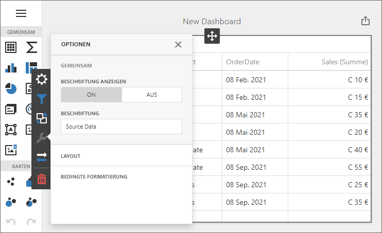

<!-- default badges list -->

<!-- default badges end -->
# Dashboard for MVC - Localization

The example shows how to localize an ASP.NET MVC Dashboard extension:

- Translate UI element captions to a different language: dialog boxes, buttons, menu items, error messages, etc.
- Format numbers, dates, and currencies according to specific culture settings.

## Example Structure

The example contains two projects that show how to localize the Web Dashboard in case _automatic_ or _manual_ script integration. Both projects localize the ASP.NET MVC Dashboard extension for the German market with the [satellite resource assemblies](https://docs.devexpress.com/Dashboard/402536/web-dashboard/aspnet-mvc-dashboard-extension/localization#localize-ui). The extension uses Globalize to format to dates, numbers, and currencies. 

The example also shows how to apply custom formatting for numbers and dates.

### Automatic Script Registration

<!-- default file list -->
*Files to look at*:

* [Index.cshtml](./CS/DashboardLocalizationMVC/Views/Home/Index.cshtml)
* [Web.config](./CS/DashboardLocalizationMVC/Web.config)
<!-- default file list end -->

The **DashboardLocalizationMVC** project registers client libraries automatically. Globalize is included when you [register third-party libraries](https://docs.devexpress.com/Dashboard/402120/web-dashboard/aspnet-mvc-dashboard-extension/required-client-libraries#automatic-integration).

### Manual Script Registration

<!-- default file list -->
*Files to look at*:

* [Index.cshtml](./CS/DashboardLocalizationManualMVC/Views/Home/Index.cshtml)
* [_Layout.cshtml](./CS/DashboardLocalizationManualMVC/Views/Shared/_Layout.cshtml)
* [Web.config](./CS/DashboardLocalizationManualMVC/Web.config)
<!-- default file list end -->

The **DashboardLocalizationManualMVC** project prevents the Web Dashboard control from loading client libraries automatically and references [Globalize and other libraries](https://docs.devexpress.com/Dashboard/402120/web-dashboard/aspnet-mvc-dashboard-extension/required-client-libraries#manual-integration) on the web page.

## Documentation

- [Localize ASP.NET MVC Dashboard Extension](https://docs.devexpress.com/Dashboard/402536/web-dashboard/aspnet-mvc-dashboard-extension/localization)

## More Examples

- [ASP.NET Core Dashboard Control - Localization](https://github.com/DevExpress-Examples/asp-net-core-dashboard-localization)
- [ASP.NET Web Forms Dashboard Control - Localization](https://github.com/DevExpress-Examples/asp-net-web-forms-dashboard-localization)
- [Dashboard for Angular - Localization](https://github.com/DevExpress-Examples/angular-dashboard-localization)
- [Dashboard for React - Localization](https://github.com/DevExpress-Examples/react-dashboard-localization)
- [Dashboard for Vue - Localization](https://github.com/DevExpress-Examples/vue-dashboard-localization)
- [Dashboard Control for JavaScript Applications - Localization](https://github.com/DevExpress-Examples/javascript-dashboard-localization)
